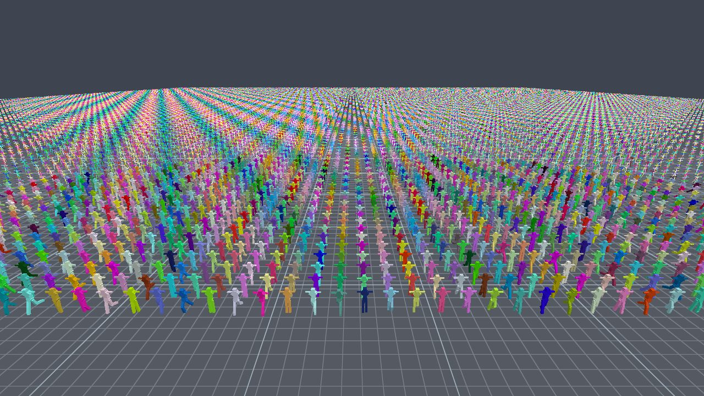

# marrow

[](https://github.com/jesta88/marrow/actions/workflows/ci.yml)

**A pure-C11, zero-dependency, engine- and renderer-agnostic animation runtime for games.**



*The [demo](demo/)'s unified LOD field at 65,536 entities: each character is classified per frame by camera distance into a CPU Tier-A foreground and a baked-GPU Tier-B crowd, the far tail rendered as bone-line skeletons. Capture your own with `marrow_demo --no-hud --screenshot hero.png`.*

marrow turns skeletons and animation clips into skinning matrices. It is *batch-first*: one
call animates `N` instances that share a skeleton, so you can drive tens of thousands of
characters without tens of thousands of per-instance virtual calls. It never allocates, never
touches a graphics API, and never spawns a thread it doesn't own — it emits data and the format
specs to decode it, and leaves scheduling, GPU upload, and the animation state machine to you.

> Think *ozz-animation's quality and offline pipeline, but in C with a flat universal ABI,
> designed across-instance so the crowd case vectorizes, with a baked-texture GPU crowd tier
> built into the same asset pipeline.*

The public API is the single header [`marrow.h`](marrow.h). All symbols are prefixed `mrw_`
(types/functions) or `MRW_` (macros/enums). The on-disk format is `.mrw` (magic `MRRW`).

📖 **Documentation:** **<https://jesta88.github.io/marrow/>** — quick start, how-to guides,
concepts, and the API reference (generated from `marrow.h`). Built from [`site/`](site/) with
Doxygen; see [`Doxyfile`](Doxyfile).

---

## Why marrow

- **Zero runtime dependencies, zero allocation.** Pure C11, no libc beyond `<math.h>`. Every
  buffer is sized by a `*_requirements()` query that returns both **size and alignment**; you
  bring the allocator. Console- and fixed-budget-friendly.
- **Flat C ABI.** `extern "C"`, compiles as both C11 and C++, out-params + result codes, no SIMD
  types in public structs. Trivial to bind from any language; no C++ integration tax.
- **Batch-first and data-oriented (SoA).** The crowd story is the spine. The hot path **fuses**
  local → model → skinning and writes the canonical 3×4 palette directly, vectorized
  *across instances* (lane *i* = instance *i*).
- **Runtime SIMD dispatch, no lazy globals.** Scalar, SSE2, and AVX2 (+FMA, +F16C) kernels live
  in separately-flagged translation units. Backend selection is a small caller-owned, immutable
  POD value — detected once, passed in. Buffer sizes never depend on the chosen backend.
- **Safe loader.** `.mrw` is a byte-defined little-endian wire format. The loader **validates,
  then views** — no struct overlay, no `mmap + cast`. Truncated or corrupt input fails cleanly
  (coverage-guided fuzzed; ASan/UBSan/MSan clean).
- **Two tiers, one core.** A CPU runtime tier and a baked-texture GPU crowd tier share the same
  skeleton/clip formats, decompressor, sampler, and math.

## Performance

On a shared-array rig, correctness-gated against [ozz-animation](https://github.com/guillaumeblanc/ozz-animation),
marrow's fused across-instance AVX2 batch produces a **16 384-instance, 14-bone** skinning
palette at **8.1 ns per (instance·joint) — 1.85 ms/frame, single-threaded — versus ozz's 34.7 ns
(7.96 ms/frame): ~4.3× faster.** The gap widens at crowd scale: ozz's per-instance sampling
contexts (≈32 MB at 16 k) spill L3, while marrow's `O(1)` scratch stays cache-resident. (ozz
wins at `N = 1` — wide lanes go to waste on a single instance.)

*Methodology:* both libraries produce the identical per-instance `model × inverse_bind` palette for
`N` instances of one shared rig, each sampled at its own time, single-threaded, each on its best
backend (marrow AVX2+FMA vs ozz 0.16.0 AVX2); measured on a Ryzen 7 7700X (Zen 4), Release MSVC x64.
The comparison is correctness-gated (sub-millimetre vertex agreement) and a no-allocation gate stays
silent for every timed window, for both libraries. The harness lives in [`bench/`](bench/)
(`-DMRW_BUILD_OZZ_BENCH=ON`); the methodology was independently reviewed before any number was trusted.

---

## Two tiers, one core

marrow is one skeletal pipeline with two consumption tiers, related as a fidelity LOD.

```
                ┌──────────── shared core (C, SoA SIMD, no alloc) ────────────┐
  .mrw blob ──► │ skeleton │ clip decode │ sample │ blend/additive/mask │ IK │ │
                └──────────────┬──────────────────────────────────┬───────────┘
                               │                                  │ (offline tool only)
                   Tier A: CPU runtime pose           Tier B: baked per-bone palettes
                   full control — blend trees,         fixed clip set, fixed rate,
                   IK, partial blends, root motion     ≤2-clip cross-fade in shader
                               │                                  │
                               ▼                                  ▼
                  canonical 3×4 skinning palette  ⇄  shader decode (same layout)
```

- **Tier A (CPU runtime)** samples clips, blends/masks/adds poses, solves IK, runs the hierarchy,
  and writes the skinning palette — full per-frame control, engine-driven. This is the marrow
  runtime library.
- **Tier B (baked GPU crowd tier)** bakes a fixed clip set offline into per-bone `Q+T+scale`
  textures whose memory scales with `bones × frames`, not vertices. The runtime *consumes and
  validates* the baked blob; a reference vertex shader decodes it on the GPU.

**The honest relationship:** Tier B is **exact at baked frames** (within half-float quantization)
and **approximate between them** — it interpolates already-composed transforms (chord, not arc),
so it is a frozen cache of discrete Tier A palettes with approximate temporal interpolation. It
is right for distant crowds; promote to Tier A when exact local-space blending matters (near
camera, gameplay-critical). marrow never grows GPU hierarchy evaluation, masks, IK, or runtime
graphs — that's the guardrail.

---

## Quick start

marrow builds with CMake (+ Ninja recommended). The runtime itself is just the C sources under
`src/` plus `marrow.h` — it has no third-party dependencies and can be dropped straight into an
existing build.

### Build & test

```sh
cmake -S . -B out/build -G Ninja
cmake --build out/build
ctest --test-dir out/build --output-on-failure
```

On Windows with Visual Studio, the supplied [`CMakePresets.json`](CMakePresets.json) wraps this:

```sh
cmake --preset x64-release
cmake --build out/build/x64-release
ctest --test-dir out/build/x64-release --output-on-failure
```

Notable CMake options (all default-sensible):

| Option | Default | Builds |
|---|---|---|
| `MRW_BUILD_TESTS` | `ON` | The CTest suite (parity, golden bytes, malformed-input, fuzz replay, …) |
| `MRW_BUILD_TOOLS` | `ON` | The offline tools `gltf2marrow` and `marrow-bake` |
| `MRW_BUILD_DEMO` | `OFF` | The GLFW + Vulkan demo (needs the Vulkan SDK) — see [`demo/`](demo/) |
| `MRW_BUILD_OZZ_BENCH` | `OFF` | The ozz-animation throughput comparison (fetches ozz; never linked into the runtime) |
| `MRW_SANITIZE` | *off* | ASan/UBSan/MSan instrumentation, e.g. `-DMRW_SANITIZE=address,undefined` |

### Animate one character (Tier A)

```c
#include "marrow.h"

/* `data` is a >=64-byte-aligned buffer holding a .mrw file you loaded. */
mrw_blob blob;
if (mrw_blob_open(data, size, &blob) != MRW_OK) { /* reject — corrupt/incompatible */ }

mrw_skeleton_view skel;
mrw_clip_view     clip;
mrw_blob_skeleton(&blob, &skel);
mrw_clip_view_at(&blob, /*section index*/ 1, &clip);

/* Caller-owned, >=16-byte-aligned scratch buffers (joint_capacity * 12 floats each). */
float scratch_model[MAX_JOINTS * 12];
float palette      [MAX_JOINTS * 12];

/* Fused: sample @ time t -> hierarchy compose -> apply inverse-bind.
   `palette` now holds joint_count canonical 3×4 skinning matrices. */
mrw_clip_to_palette(&skel, &clip, /*t=*/1.25f, scratch_model, palette, MAX_JOINTS);
```

### Animate a crowd (the batch path)

```c
mrw_dispatch disp;
mrw_dispatch_detect(&disp);            /* AVX2(+FMA) ▸ SSE2 ▸ scalar */

/* Query sizes + alignments; you provide the memory. */
mrw_mem_req scratch_req, pal_req;
mrw_batch_clip_to_palette_requirements(joint_count, N, MRW_PALETTE_F32,
                                       &scratch_req, &pal_req);
void  *scratch  = aligned_alloc(scratch_req.align, scratch_req.size);  /* >=64-aligned */
float *palettes = aligned_alloc(pal_req.align,     pal_req.size);      /* >=16-aligned */

/* One call, N instances sharing this skeleton+clip, each at its own time. Output is the
   per-instance, joint-contiguous AoS 3×4 palette. Side-effect-free: schedule it across your
   own threads with shared read-only views and per-thread scratch. */
mrw_batch_clip_to_palette(&disp, &skel, &clip, times, N,
                          palettes, pal_req.size, scratch, scratch_req.size);
```

The batch API also covers **blend / additive-layer cross-fades**
(`mrw_batch_blend_clips_to_palette`, `mrw_batch_accumulate_to_palette`) and an opt-in **f16
palette** (`*_f16`, half the upload/fetch bandwidth). Single-pose Tier-A primitives include pose
`blend` / `make_additive` / `accumulate` / per-joint mask, analytic two-bone and aim **IK**, and
**root motion**. The scalar backend is the bit-exact reference the SIMD kernels are checked
against. See [`marrow.h`](marrow.h) for the full, documented surface.

---

## Offline tools

The runtime only *consumes* assets. Producing them lives in separate targets that may use heavy
libraries and are never linked into the runtime:

- **`gltf2marrow`** — imports a glTF 2.0 skin + animations into a v0 `.mrw` (vendored cgltf;
  resamples to dense clips; self-validates before emit).
- **`marrow-bake`** — bakes a `.mrw` clip set into a Tier-B baked texture section, polar-decomposing
  each bone to `Q+T+uniform-scale`, measuring the reconstruction residual, and **rejecting rigs
  that can't be represented** (they stay valid Tier-A assets — there is no lossy full-matrix
  fallback).

Reference GPU skinning shaders (GLSL + HLSL) that decode the baked palette live in
[`examples/skinning/`](examples/skinning/) — example code only, not part of the zero-dependency
runtime.

---

## Project layout

```
marrow.h            The complete public API (single header).
src/                The runtime: math, dispatch, .mrw loader, pose pipeline,
                    blend/additive/mask, IK, batch + per-ISA SIMD kernels.
tools/              Offline tools: gltf2marrow, marrow-bake, the .mrw authoring lib.
examples/skinning/  Reference GPU vertex shaders for the baked tier (GLSL + HLSL).
demo/               Optional GLFW + Vulkan demo (-DMRW_BUILD_DEMO=ON).
bench/              ozz-animation throughput comparison (gated).
tests/              CTest suite: parity, golden bytes, malformed-input, fuzzing.
```

## Platforms

Desktop x64 and current/last-gen consoles (little-endian). **AVX2 (+FMA)** is the primary fast
path; **SSE2** is the portable x64 baseline and fallback (also the right width for Jaguar-class
PS4/Xbox One); **scalar** is the reference and ultimate fallback. Determinism is **visual-only** —
FMA and reordered reductions are fair game, so results are not bit-identical across machines.

## Status

**First public release — 0.1.0 (pre-1.0).** The v0 contracts and the `.mrw` on-disk format are
ratified and evolve backward-additively (new layouts arrive only as new codec/encoding ids; existing
assets keep loading); as a 0.x release they may still gain or refine surface before 1.0. The CPU
runtime — math core, loader, sampling, skinning palette, pose algebra, IK, root motion, and the
across-instance SSE2/AVX2 batch path — is implemented and gated by CI across GCC / Clang (ASan+UBSan)
/ MSVC. The public API and its contracts are documented in [`marrow.h`](marrow.h).

## License

[MIT](LICENSE) — permissive, OSI-approved, and GPL-compatible. © 2026 Jérémie St-Amand.
```